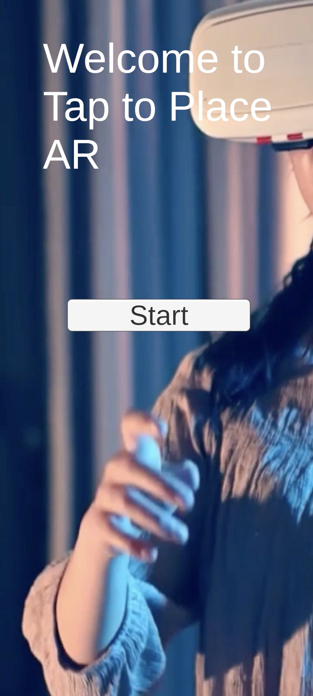
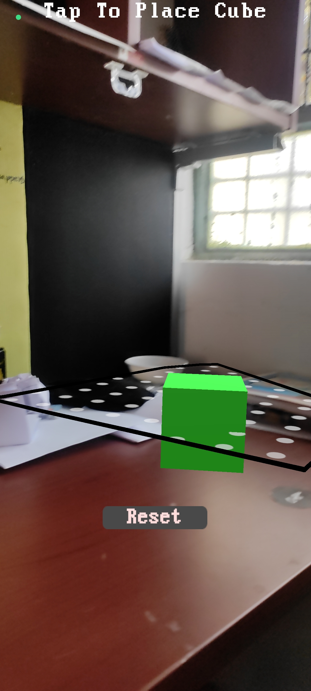
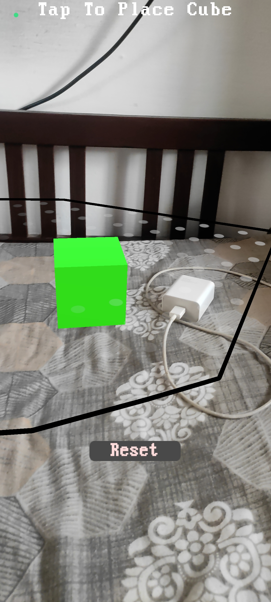

## First Project on Tap to Place AR

In this project, the plane is automatically detected in Argumented Reality and  you can tap on it to Place a cube over the plane in AR.

[**_Click to view the Tap to Place script_**](https://github.com/AryanPant/Tap-to-place/blob/main/Assets/Scripts/TapToPlace.cs)

[**_Click to view the scripts folder_**](https://github.com/AryanPant/Tap-to-place/tree/main/Assets/Scripts)

[**_Click to download APK_**](https://github.com/AryanPant/Tap-to-place/raw/main/Tap-to-place.apk)

### Screenshots

